# CollabNote - A NestJS, React, Vite, and Supabase Fullstack Notetaking App

[](https://nestjs.com/)
[](https://reactjs.org/)
[](https://vitejs.dev/)
[](https://supabase.io/)
[](https://www.postgresql.org/)
[](https://developer.mozilla.org/en-US/docs/Web/API/WebSockets_API)
[](https://jestjs.io/)
[](https://mui.com/)
[](https://swagger.io/)
[](https://graphql.org/)
[](https://www.typescriptlang.org/)
[](https://vercel.com/)
[](https://render.com/)
[](https://www.docker.com/)
[](https://nginx.org/)
[](https://www.jenkins.io/)
[](https://kubernetes.io/)

CollabNote is a collaborative notes platform designed to help users create, share, organize, and manage notes efficiently. It provides a modern frontend, scalable backend APIs, real-time collaboration, authentication, and multiple deployment options.

## Table of Contents

* [💡 Features](#-features)
* [🚀 Deployment](#-deployment)
* [🎯 Tech Stack](#-tech-stack)
* [🖼️ UI Overview](#-ui-overview)
* [📂 Project Structure](#-project-structure)
* [🛠️ Getting Started](#-getting-started)

  * [Prerequisites](#prerequisites)
  * [Installation](#installation)
  * [Running Locally](#running-locally)
  * [Using Docker](#using-docker)
* [📖 API Documentation](#-api-documentation)

  * [API Endpoints](#api-endpoints)
  * [Database Schema](#database-schema)
  * [Using the OpenAPI File](#using-the-openapi-file)
* [🖥️ GraphQL Integration](#-graphql-integration)
* [🧰 Nginx Configuration](#-nginx-configuration)
* [🌐 Kubernetes Deployment](#-kubernetes-deployment)
* [👨🏻‍💻 Continuous Integration and Deployment with Jenkins](#-continuous-integration-and-deployment-with-jenkins)
* [🧪 Testing](#-testing)
* [🤝 Contributing](#-contributing)
* [📄 License](#-license)
* [🎉 Acknowledgments](#-acknowledgments)

## 💡 Features

* **Authentication:** Secure user registration, login, and password management.
* **Notes Management:** Create, update, delete, and reorder notes.
* **Sharing:** Share notes with other users.
* **Real-Time Syncing:** Synchronize notes across devices and users using Supabase and WebSockets.
* **Collaboration:** Collaborate with other users in real time.
* **Search:** Search notes by title or content.
* **User Profiles:** Manage and search user profiles.
* **Profile Settings:** Update profile information.
* **Dark Mode:** Switch between light and dark themes.
* **Testing:** Unit and integration tests for backend and frontend.
* **Responsive Design:** Optimized for different devices and screen sizes.
* **Swagger Documentation:** Interactive API documentation.
* **GraphQL:** Support for querying and manipulating application data.
* **CI/CD:** Jenkins-based continuous integration and deployment support.
* **Docker:** Containerized deployment support.
* **Nginx:** Reverse proxy and load-balancing configuration.
* **Kubernetes:** Kubernetes deployment configuration.

## 🚀 Deployment

The frontend can be deployed on Vercel.

**Frontend:**
https://collabnote-app.vercel.app/

The backend API is deployed on Render.

**Backend API / Swagger:**
https://collabnote-fullstack-app.onrender.com/

A backup frontend deployment is also available on Netlify.

**Netlify:**
https://notesapp-nestjs.netlify.app/

> [!IMPORTANT]
> The backend API may spin down after a period of inactivity depending on the hosting plan. If the first request takes a few seconds, wait for the service to wake up and try again.

> [!CAUTION]
> Supabase projects may pause or become unavailable depending on usage and free-tier limitations. If authentication or database requests stop working, check the Supabase project status and environment configuration.

## 🎯 Tech Stack

| Technology                                                                    | Description                                          |
| ----------------------------------------------------------------------------- | ---------------------------------------------------- |
| [NestJS](https://nestjs.com/)                                                 | Backend framework for scalable APIs                  |
| [React](https://react.dev/)                                                   | Frontend library for building the user interface     |
| [Vite](https://vitejs.dev/)                                                   | Frontend build tool                                  |
| [Supabase](https://supabase.com/)                                             | Backend-as-a-service for authentication and database |
| [WebSockets](https://developer.mozilla.org/en-US/docs/Web/API/WebSockets_API) | Real-time communication and synchronization          |
| [PostgreSQL](https://www.postgresql.org/)                                     | Relational database                                  |
| [TypeScript](https://www.typescriptlang.org/)                                 | Type-safe development                                |
| [Swagger](https://swagger.io/)                                                | API documentation and testing                        |
| [Docker](https://www.docker.com/)                                             | Containerization                                     |
| [Nginx](https://nginx.org/)                                                   | Reverse proxy and load balancing                     |
| [Jenkins](https://www.jenkins.io/)                                            | CI/CD automation                                     |
| [Render](https://render.com/)                                                 | Backend hosting platform                             |
| [Vercel](https://vercel.com/)                                                 | Frontend hosting platform                            |
| [GraphQL](https://graphql.org/)                                               | API query language                                   |

## 🖼️ UI Overview

### Home Page

<p align="center">
  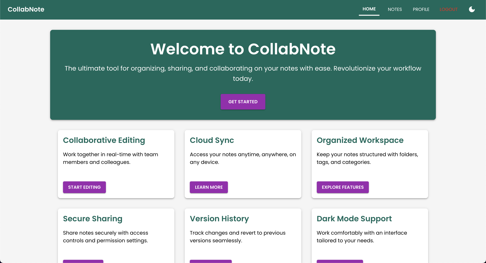
</p>

### Home Page - Dark Mode

<p align="center">
  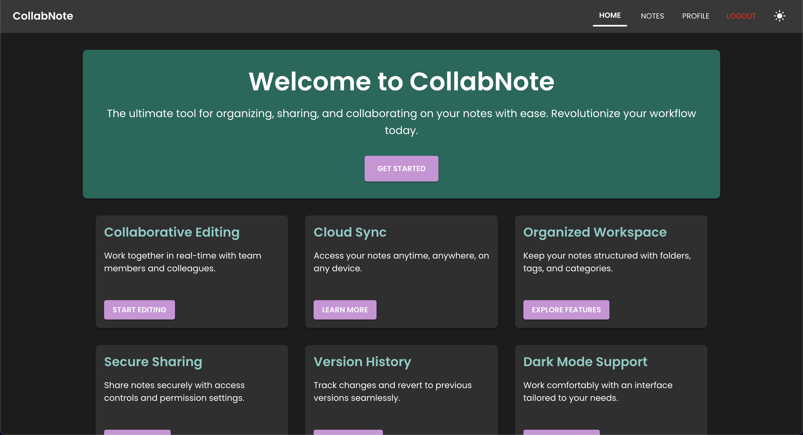
</p>

### Notes Dashboard

<p align="center">
  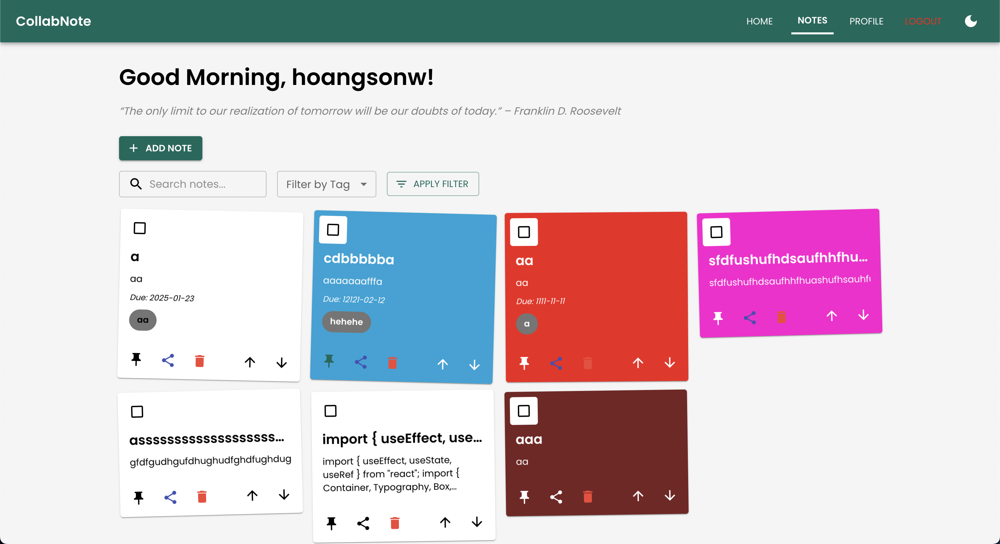
</p>

### Notes Dashboard - Dark Mode

<p align="center">
  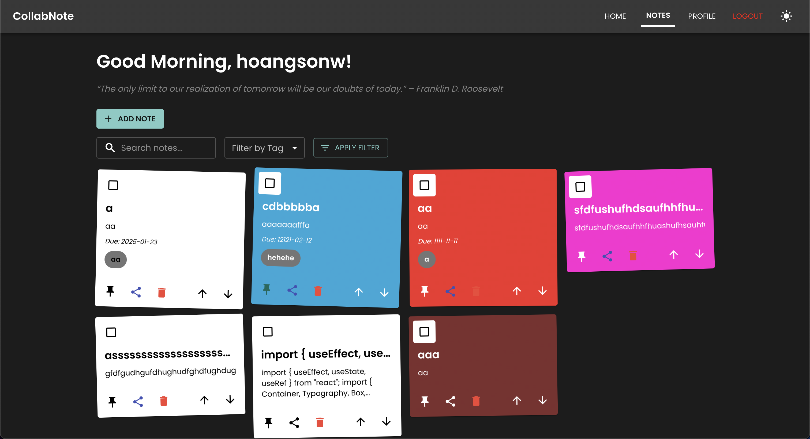
</p>

### Add Note Modal

<p align="center">
  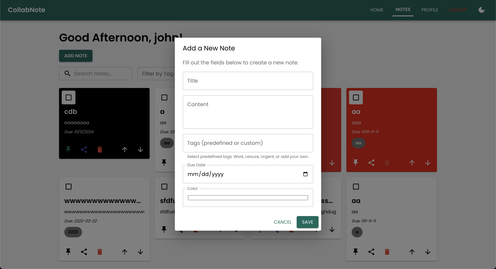
</p>

### Note Details Modal

<p align="center">
  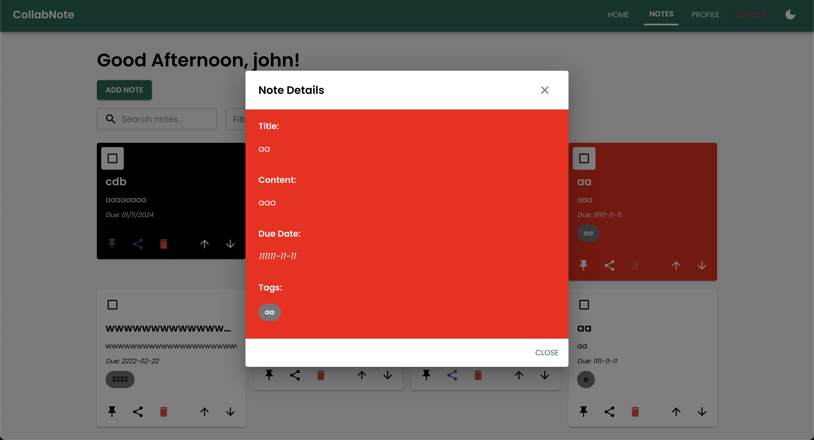
</p>

### Note Editor

<p align="center">
  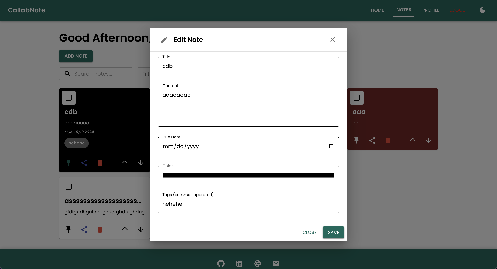
</p>

### Profile Page

<p align="center">
  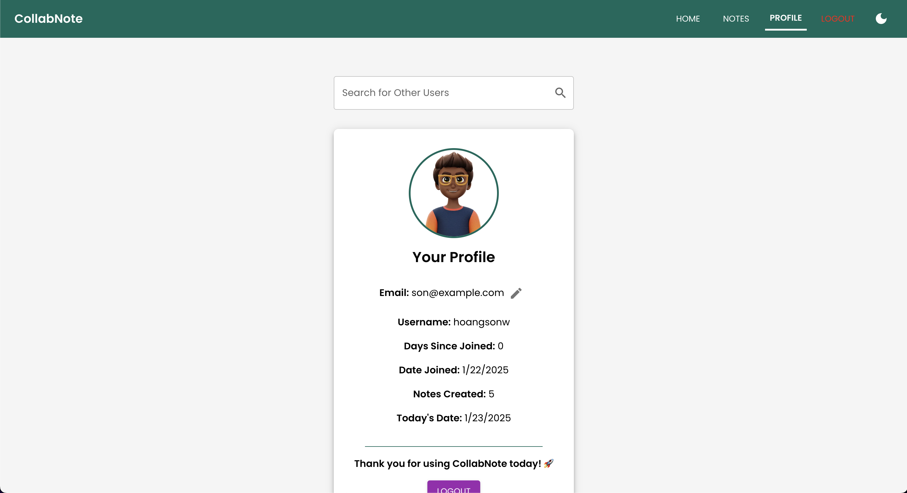
</p>

### Profile Page - Dark Mode

<p align="center">
  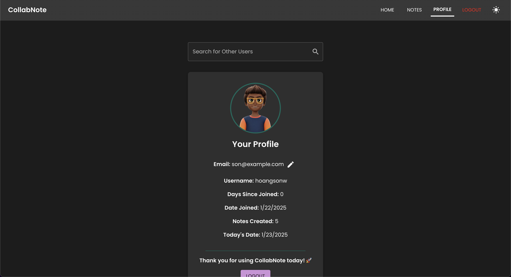
</p>

### Login Page

<p align="center">
  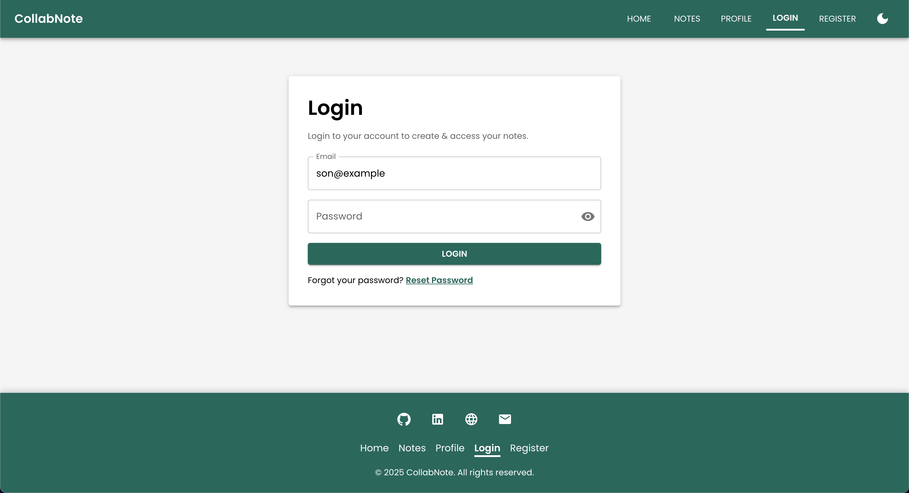
</p>

### Login Page - Dark Mode

<p align="center">
  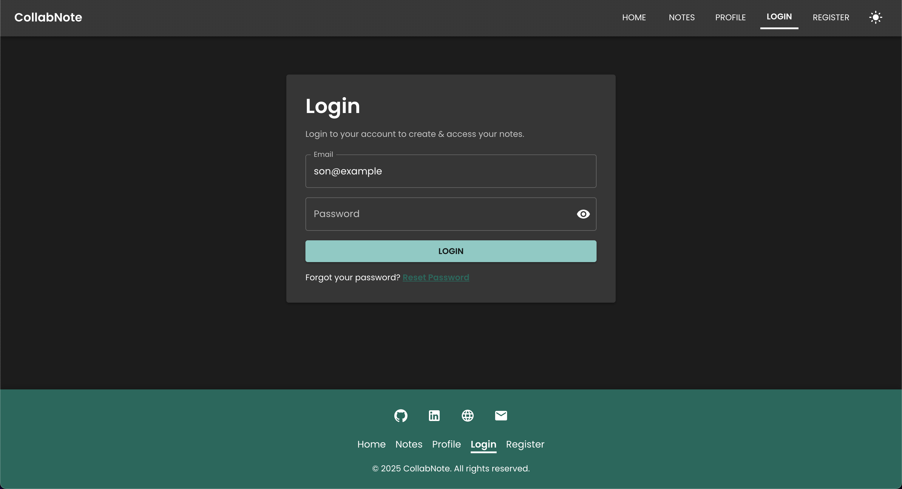
</p>

### Register Page

<p align="center">
  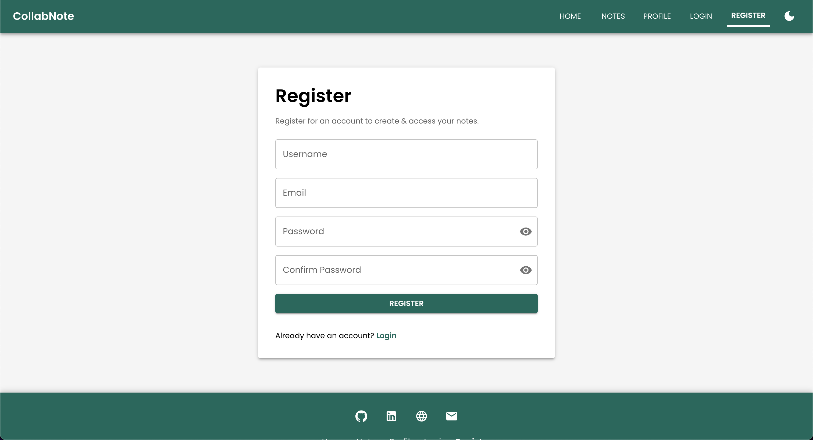
</p>

### Register Page - Dark Mode

<p align="center">
  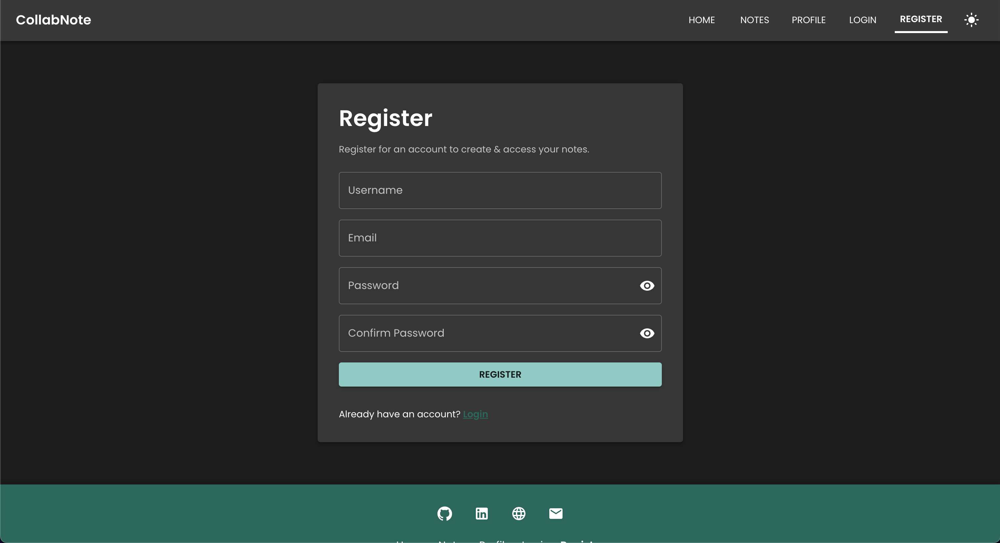
</p>

### Reset Password Page

<p align="center">
  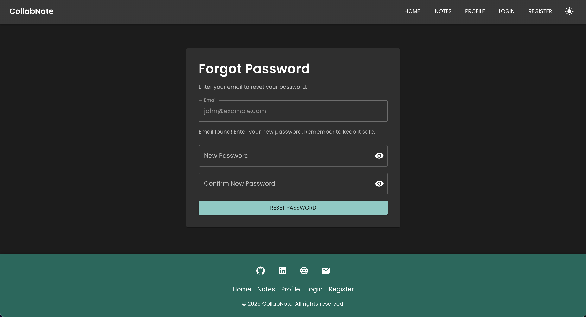
</p>

### Reset Password Page - Dark Mode

<p align="center">
  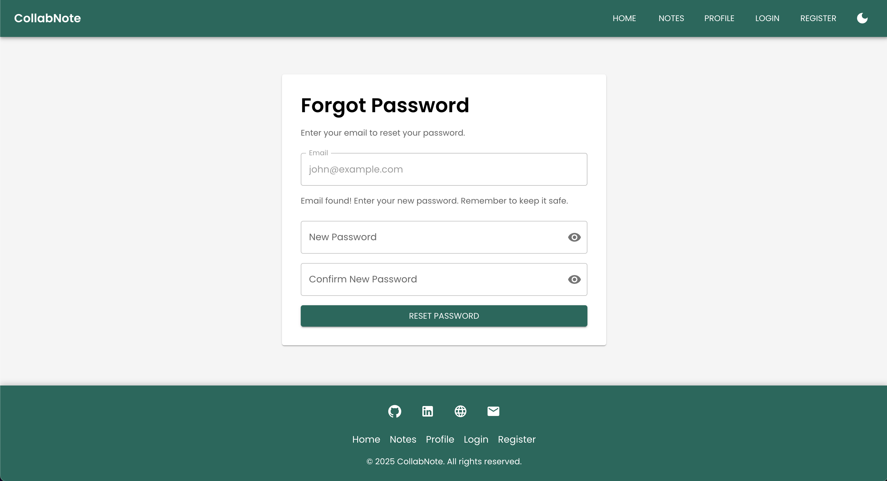
</p>

### API Documentation

<p align="center">
  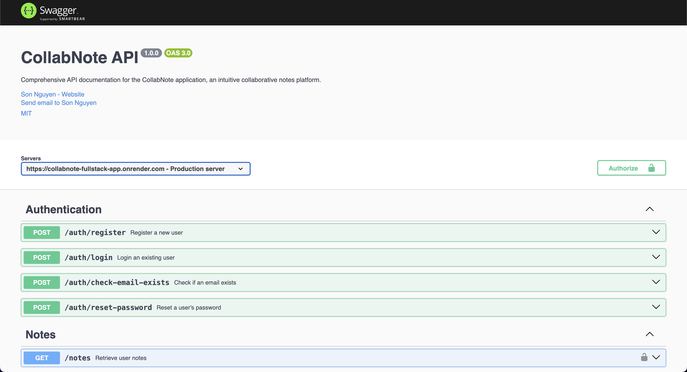
</p>

## 📂 Project Structure

```text
CollabNote-Fullstack-App/

├── backend/
│   ├── src/
│   │   ├── auth/
│   │   │   ├── auth.module.ts
│   │   │   ├── auth.controller.ts
│   │   │   ├── auth.service.ts
│   │   │   ├── auth.schema.ts
│   │   │   ├── auth.resolver.ts
│   │   │   └── jwt.strategy.ts
│   │   ├── dto/
│   │   │   ├── create-note.input.ts
│   │   │   └── update-note.input.ts
│   │   ├── notes/
│   │   │   ├── notes.schema.ts
│   │   │   ├── notes.resolver.ts
│   │   │   ├── notes.module.ts
│   │   │   ├── notes.controller.ts
│   │   │   └── notes.service.ts
│   │   ├── profile/
│   │   │   ├── profile.schema.ts
│   │   │   ├── profile.resolver.ts
│   │   │   ├── profile.module.ts
│   │   │   ├── profile.controller.ts
│   │   │   └── profile.service.ts
│   │   ├── supabase/
│   │   │   ├── supabase.module.ts
│   │   │   └── supabase.service.ts
│   │   ├── types/
│   │   │   └── authenticated-request.ts
│   │   ├── schema.gql
│   │   ├── app.module.ts
│   │   ├── app.test.ts
│   │   └── main.ts
│   ├── .env
│   ├── build-backend.sh
│   ├── Dockerfile
│   ├── docker-compose.yml
│   ├── package.json
│   ├── package-lock.json
│   ├── tsconfig.json
│   └── vercel.json
│
├── frontend/
│   ├── public/
│   │   ├── favicon.ico
│   │   ├── index.html
│   │   └── manifest.json
│   ├── src/
│   │   ├── assets/
│   │   │   └── logo.png
│   │   ├── components/
│   │   │   ├── LoadingOverlay.tsx
│   │   │   └── PasswordField.tsx
│   │   ├── layout/
│   │   │   ├── ResponsiveDrawer.tsx
│   │   │   ├── Footer.tsx
│   │   │   ├── Layout.tsx
│   │   │   └── Navbar.tsx
│   │   ├── routes/
│   │   │   ├── ForgotPasswordPage.tsx
│   │   │   ├── HomePage.tsx
│   │   │   ├── LoginPage.tsx
│   │   │   ├── NoteDetailsPage.tsx
│   │   │   ├── NotesPage.tsx
│   │   │   ├── ProfilePage.tsx
│   │   │   └── RegisterPage.tsx
│   │   ├── theme/
│   │   │   ├── index.ts
│   │   │   ├── ThemeContext.tsx
│   │   │   └── ThemeProviderWrapper.tsx
│   │   ├── App.tsx
│   │   ├── App.test.tsx
│   │   ├── App.css
│   │   ├── index.css
│   │   ├── main.tsx
│   │   └── vite-env.d.ts
│   ├── .gitignore
│   ├── package.json
│   ├── package-lock.json
│   ├── Dockerfile
│   ├── docker-compose.yml
│   ├── index.html
│   ├── build-frontend.sh
│   ├── vercel.json
│   ├── vite.config.ts
│   ├── tsconfig.app.json
│   ├── tsconfig.node.json
│   └── tsconfig.json
│
├── kubernetes/
│   ├── backend-deployment.yaml
│   ├── backend-service.yaml
│   ├── frontend-deployment.yaml
│   ├── frontend-service.yaml
│   └── configmap.yaml
│
├── nginx/
│   ├── start_nginx.sh
│   ├── nginx.conf
│   ├── docker-compose.yml
│   └── Dockerfile
│
├── images/
├── .env
├── docker-compose.yml
├── package.json
├── package-lock.json
├── vercel.json
├── openapi.yaml
├── jenkins_cicd.sh
├── LICENSE
├── README.md
└── ...
```

## 🛠️ Getting Started

Follow the steps below to run CollabNote locally.

### Prerequisites

Make sure the following tools are installed:

* **Node.js:** v18 or above
* **npm:** v9 or above
* **PostgreSQL:** v15 or above
* **Docker:** Optional

### Installation

#### 1. Clone the Repository

```bash
git clone https://github.com/careers-umair-dev/CollabNote-Fullstack-App.git
cd CollabNote-Fullstack-App
```

#### 2. Install Backend Dependencies

```bash
cd backend
npm install
```

#### 3. Install Frontend Dependencies

```bash
cd ../frontend
npm install
```

### Environment Variables

Create environment files locally. **Do not commit secrets or `.env` files to GitHub.**

#### Backend

Create:

```text
backend/.env
```

Example:

```env
SUPABASE_URL=your_supabase_url
SUPABASE_SERVICE_KEY=your_supabase_service_key
JWT_SECRET=your_jwt_secret
JWT_EXPIRES_IN=1d
PORT=4000
```

#### Frontend

Create:

```text
frontend/.env
```

Example:

```env
VITE_API_URL=http://localhost:4000
```

For production deployments, configure these variables in the hosting platform's environment-variable settings instead of committing them to the repository.

### Running Locally

#### Start the Backend

```bash
cd backend
npm run start:dev
```

Backend:

```text
http://localhost:4000
```

Swagger:

```text
http://localhost:4000/api
```

#### Start the Frontend

Open another terminal:

```bash
cd frontend
npm run dev
```

The frontend will normally be available at the Vite-provided local URL, for example:

```text
http://localhost:5172
```

## Using Docker

### Build and Run Containers

```bash
docker-compose up --build
```

Depending on the Docker configuration, services may be available through:

```text
Backend:  http://localhost:4000
Frontend: http://localhost:3000
```

## 📖 API Documentation

The REST APIs are documented using Swagger.

Local Swagger:

```text
http://localhost:4000/api
```

Production Swagger:

```text
https://collabnote-fullstack-app.onrender.com/api
```

### API Endpoints

| Method | Endpoint                   | Description                               |
| ------ | -------------------------- | ----------------------------------------- |
| POST   | `/auth/register`           | Register a new user                       |
| POST   | `/auth/login`              | Login an existing user                    |
| POST   | `/auth/check-email-exists` | Check whether an email exists             |
| POST   | `/auth/reset-password`     | Reset a user's password                   |
| GET    | `/notes`                   | Retrieve user notes                       |
| POST   | `/notes`                   | Create a new note                         |
| PATCH  | `/notes/{id}`              | Update a note                             |
| DELETE | `/notes/{id}`              | Delete a note                             |
| POST   | `/notes/{id}/share`        | Share a note with another user            |
| POST   | `/notes/reorder`           | Reorder user notes                        |
| GET    | `/profile/me`              | Retrieve the authenticated user's profile |
| GET    | `/profile/userId/{id}`     | Retrieve a user profile by ID             |
| GET    | `/profile/search`          | Search for a user profile                 |
| PATCH  | `/profile/me`              | Update the authenticated user's profile   |

### Database Schema

The application uses PostgreSQL through Supabase.

<p align="center">
  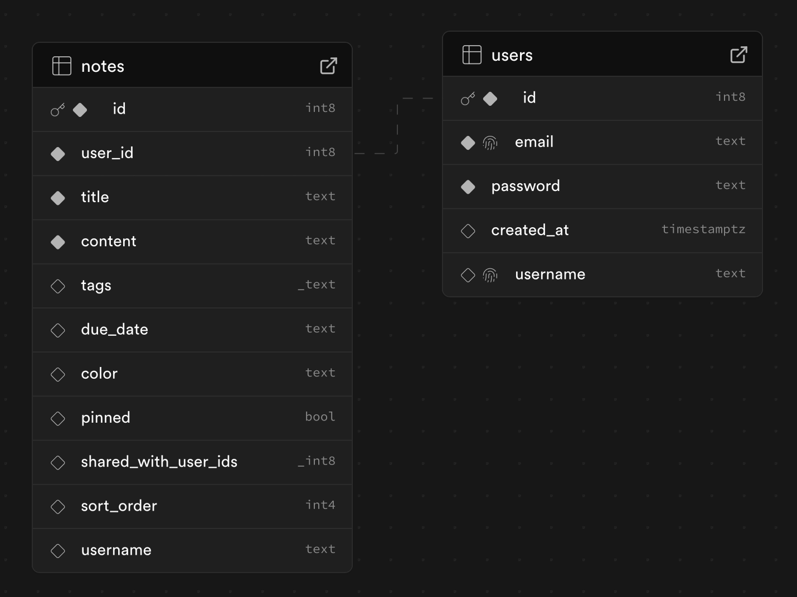
</p>

The `notes` data is associated with users through the appropriate user relationship. The database structure can be expanded as the application grows.

### Using the OpenAPI File

The project includes an `openapi.yaml` file that can be used with tools such as Swagger Editor and Postman.

#### 1. View API Documentation

Open [Swagger Editor](https://editor.swagger.io/) and upload the `openapi.yaml` file.

#### 2. Test the API

You can import the OpenAPI file into [Postman](https://www.postman.com/):

```text
Postman → Import → Select openapi.yaml
```

You can then test the documented API endpoints.

#### 3. Generate Client Libraries

Install OpenAPI Generator:

```bash
npm install @openapitools/openapi-generator-cli -g
```

Generate a client:

```bash
openapi-generator-cli generate -i openapi.yaml -g <language> -o ./client
```

Replace `<language>` with the required programming language.

#### 4. Generate Server Stubs

```bash
openapi-generator-cli generate -i openapi.yaml -g <framework> -o ./server
```

Replace `<framework>` with the required server framework.

#### 5. Run a Mock Server

Install Prism:

```bash
npm install -g @stoplight/prism-cli
```

Start the mock server:

```bash
prism mock openapi.yaml
```

#### 6. Validate the OpenAPI File

Use the [Swagger Validator](https://validator.swagger.io/) to validate the OpenAPI specification.

## 🖥️ GraphQL Integration

CollabNote also supports GraphQL for querying and manipulating application data.

Production GraphQL endpoint:

```text
https://collabnote-fullstack-app.onrender.com/graphql
```

Local GraphQL endpoint:

```text
http://localhost:4000/graphql
```

You can use the GraphQL interface to explore queries and mutations.

Example query:

```graphql
query {
  getUserNotes(userId: 1, searchQuery: "", tagFilter: "") {
    id
    title
    content
    tags
    dueDate
    color
    pinned
    sharedWithUserIds
    sortOrder
    username
  }
}
```

This query retrieves notes for the specified user based on the available GraphQL schema.

For more information, visit the [GraphQL documentation](https://graphql.org/learn/).

<p align="center">
  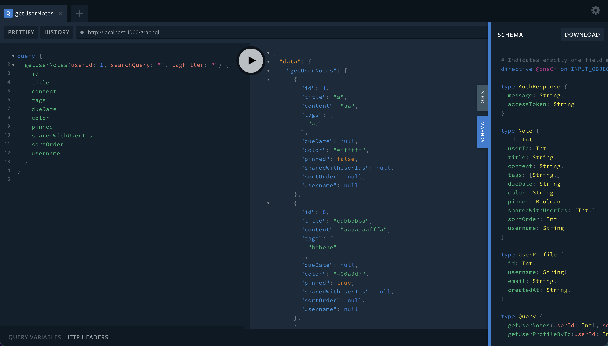
</p>

## 🧰 Nginx Configuration

The `nginx` directory contains configuration files for reverse proxying, load balancing, caching, and serving application traffic.

Example configuration:

```nginx
server {
    listen 80;
    server_name localhost;

    location / {
        proxy_pass http://localhost:3000;
        proxy_http_version 1.1;
        proxy_set_header Upgrade $http_upgrade;
        proxy_set_header Connection "upgrade";
        proxy_set_header Host $host;
        proxy_cache_bypass $http_upgrade;
    }
}
```

For more information, see the [Nginx documentation](https://nginx.org/en/docs/).

## 🌐 Kubernetes Deployment

The project includes Kubernetes configuration files inside the `kubernetes` directory.

Apply the configuration:

```bash
kubectl apply -f kubernetes/
```

The Kubernetes configuration includes:

* Backend deployment
* Backend service
* Frontend deployment
* Frontend service
* ConfigMap

After deployment, access the application using the configured Kubernetes service.

## 👨🏻‍💻 Continuous Integration and Deployment with Jenkins

The project supports Jenkins-based CI/CD workflows.

### Pipeline Configuration

A Jenkins pipeline can be configured to handle:

1. Source code checkout
2. Dependency installation
3. Automated testing
4. Application build
5. Deployment

### Environment Variables

Use Jenkins environment variables or credentials management for sensitive values such as:

* Supabase credentials
* JWT secrets
* API keys
* Deployment credentials

Never commit production secrets to GitHub.

### Deployment

The application can be deployed through supported hosting platforms such as Render, Vercel, or a dedicated server using tools such as PM2.

### Webhooks

GitHub webhooks can be configured to automatically trigger Jenkins builds when changes are pushed to the repository.

### Notifications

Jenkins can also be configured to send build and deployment notifications through supported notification services.

## 🧪 Testing

The project includes Jest-based tests for backend and frontend functionality.

### Backend Tests

```bash
cd backend
npm run test
```

### Frontend Tests

```bash
cd frontend
npm run test
```

## 🤝 Contributing

Contributions and improvements are welcome.

To contribute:

1. Fork the repository.
2. Create a new feature branch.
3. Make your changes.
4. Test your changes.
5. Commit your changes.
6. Push the branch.
7. Create a pull request.

Example:

```bash
git checkout -b feature/your-feature
git add .
git commit -m "Add your feature"
git push origin feature/your-feature
```

## 📄 License

This project is licensed under the [MIT License](https://opensource.org/licenses/MIT).

Copyright (c) 2025 Umair Ansari.

## 🎉 Acknowledgments

* **Umair Ansari:** Project maintainer.
* **NestJS:** Backend framework.
* **React:** Frontend library.
* **Vite:** Frontend build tool.
* **Supabase:** Database and backend services.
* **PostgreSQL:** Relational database.
* **GraphQL:** API query language.
* **Swagger:** API documentation.
* **Docker:** Containerization platform.
* **Nginx:** Web server and reverse proxy.
* **Jenkins:** CI/CD automation.
* **Kubernetes:** Container orchestration.

---

Thank you for visiting **CollabNote**!
**Happy notetaking!** 📝🚀

<p align="center">
  Maintained by <strong>Umair Ansari</strong>
</p>

[🔝 Back to Top](#collabnote---a-nestjs-react-vite-and-supabase-fullstack-notetaking-app)
